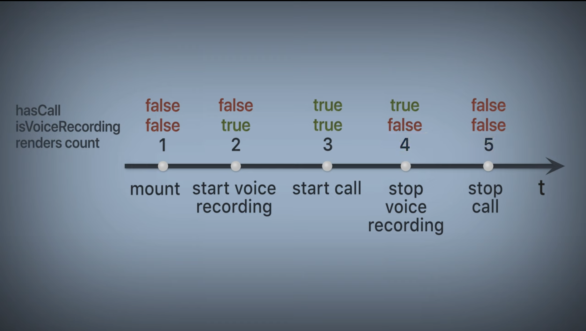
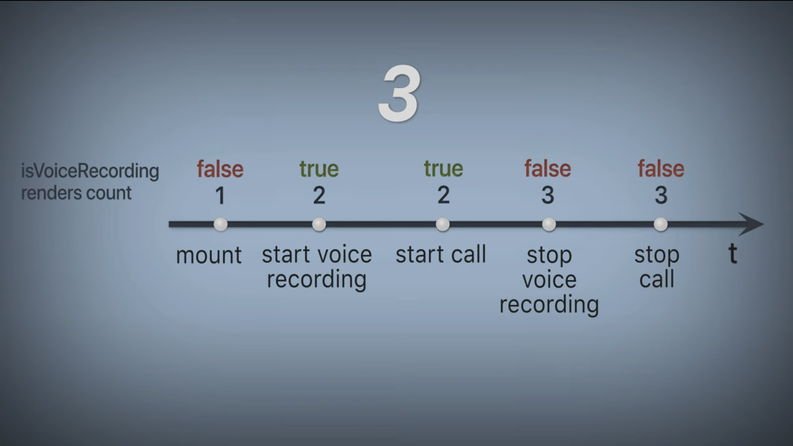

# EVENTS BUS (Шина событий)

Мы разрабатываем чат.
Мы решили записать голосовое сообщение и через несколько секунд начала его записи, поступает звонок в чат.

Наша задача прервать запись голосового сообщения, если поступил входящий звонок.

### Стандартный подход:

```tsx
// VoiceRecording component:
const [isVoiceRecording, setVoiceRecording] = useState(false)
const hasCall = useSelector(callsSelector.hasCall) // есть ли звонок

useEffect(() => {
    if (hasCall && isVoiceRecording) {
        setVoiceRecording(false)
    }
}, [hasCall])
```

**Будет 5 рендеров 🤯**



### Через Events Bus:

```tsx
// VoiceRecording component:
import eventsBus from '@/packages/eventsBus'

const [isVoiceRecording, setVoiceRecording] = useState(false)

useEffect(() => {
    const stopRecording = () => setVoiceRecording(false)

    const unsubscribe = eventsBus.startCall.subscribe(stopRecording)

    return () => unsubscribe()
}, [])

```
```tsx
// Calls component:
import eventsBus from '@/packages/eventsBus'

eventsBus.startCall.broadcast() // событие произошло
```

**Будет 3 рендера 😇**




### Пример реализация:

Файловая структура:

    ├─ packages

        └─ eventBus
    
            └─ events
    
                └─ startCall  
                └─ startVoiceRecord  
                └─ sendMessage
    
            └─ eventsBus.js  
            └─ index.js  

```js
// index.js:
import startCall from './events/startCall'
import startVoiceRecord from './events/startVoiceRecord'
import sendMessage from './events/sendMessage'

export default {
    startCall,
    startVoiceRecord,
    sendMessage
}
```

```js
import eventsBus from '../../eventsBus'

const eventName = 'startCall' // id события

const subscribe = (callback) => {
    return eventBus.subscribe(eventName, callback)
}

const broadcast = (data) => {
    eventBus.broadcast(eventName, data)
}

export default {
    subscribe, 
    broadcast    
}
```

```js
const subscriptions = {}

const subscribe = (eventName, callback) => {
    if (!subscriptions[eventName]) {
        subscriptions[eventName] = new Set()
    }

    const callbacks =  subscriptions[eventName]
    callbacks.add(callback)

    return () => {
        callbacks.delete(callback)

        if (!callback.size) {
            delete subscriptions[eventName]
        }

    }
}

const broadcast = (eventName, ...args) => {
    if (!subscriptions[eventName]) {
        return
    }

    const callbacks =  subscriptions[eventName]

    for (const callback of callbacks) {
        callback(...args)
    }
}
```
