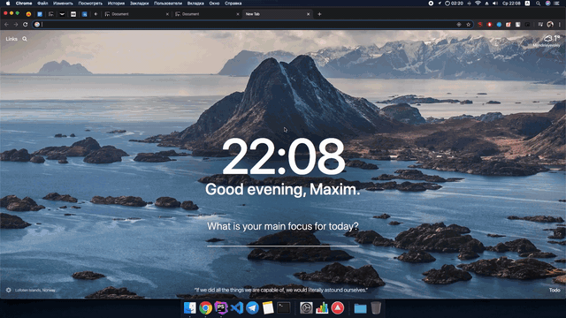

### Разработка виджета (JS)

Основые реализации:
* Каждая страница это отдельные HTML, CSS и обработчики событий.
* Виджет подружает данные для следующей страницы (вопрос или одежда) для бесшовного перехода между ними.
* Реализован упрощенный вариант состояния виджета (state), а так же componentNeedUpdate.
* Виджет хранит информацию прошел ли пользователь туториал.
* В настройках можно задать показ виджета через заданное количество ms.